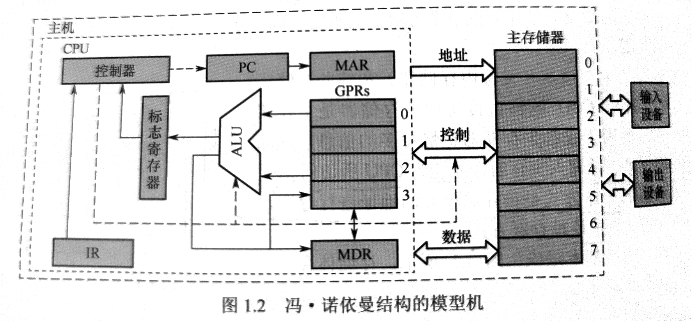

# 计算机系统概述

## Q&A
1. 计算机由哪几部分组成？以哪部分为中心？
```
1). 由`中央处理器(CPU)`，`存储器`，`运算器`，`输入设备`，`输出设备`五大部分年组成。
2). 以中央处理器为中心。
```
2. 主频高的 CPU 一定比主频低的 CPU 快吗？为什么？
3. 翻译程序，汇编程序，编译程序，解释程序有什么差别？各自的特性是什么？
4. 不同级别的语言编写的程序有什么区别？哪种语言编写的程序能被硬件直接执行？

## 计算机的发展历程
### 硬件
1. 电子管时代
2. 晶体管时代
3. 中小规模集成电路时代
4. 大规模集成电路时代

## 计算机系统层次结构
### 计算机系统组成
- 硬件
- 软件  
  软件是指运行在硬件上的**程序和相关的数据和文档**

### 计算机硬件
#### 冯诺伊曼体系
**程序存储**：将事先编制好的程序和原始数据送入主存后才能执行。程序一旦执行开始，就无需人工干预。计算机会自动逐条执行指令，直至程序结束。



#### 输入、输出设备
- 输入设备：用于将程序和数据以机器所能接受和识别的方式输入给计算机。
- 输出设备：将计算机的处理结果以人们所能理解的形式输出。

#### 存储器
- 主存、辅存
- 辅存中的信息须调入主存后，才能被 CPU 访问
- **主存工作方式**：按地址存取方式
- 组成部分：存储体，MAR（地址寄存器），MDR（数据寄存器）  
  MAR，MDR，Cache 存在于 CPU 中  
  MDR 的位数与存储字长相等

#### 运算器
- 功能：算术运算和逻辑运算。
- 组成：
    - 核心：ALU
    - 若干通用寄存器：**累加器（ACC），乘商寄存器（MQ），操作数寄存器（X）**，和基址寄存器（BR），变址寄存器（IX）
    - 程序状态寄存器，PSW

#### 控制器
- 组成：
    - 程序计数器（PC），与主存的 MAR 之间有直接通路
    - 指令存储器（IR），指令中的操作码（OP）送至 CU 用于分析指令，地址码（Ad）送至 MAR 用于取操作数
    - 控制单元（CU），分析指令并发出各种微指令序列
- 功能：
    - 控制如何修改 PC
    - 控制 ALU 执行什么运算
    - 控制内存读写

### 计算机软件

#### 三个级别的语言

- 翻译程序：将高级语言程序转换为**低级语言**程序的程序
  - 汇编程序：将汇编语言程序转换为机器语言程序
  - 解释程序：将源程序中的语句按执行顺序逐条翻译成机器指令并立即执行
  - 编译程序：将高级语言程序翻译成汇编语言程序或机器语言程序

#### 软、硬件的逻辑功能等价性

略

### 计算机系统层次结构

1. 微程序机器M0（微指令系统）

   由硬件直接执行微指令

2. 传统机器M1（用机器语言的机器）

   用微程序解释机器指令

## 计算机的性能指标

### 字长

- 字：人为规定的长度
- 机器字长
- 指令字长
- 存储字长
- 数据字长：等于数据通路带宽

### 数据通路带宽

- 数据通路：各个子系统通过总线连接形成的数据传输路径称为数据通路
- 数据通路带宽：数据总线一次所能并行传输的数据的位数

### 主存容量

表示方法：字数 x 字长（/ byte）

MAR反映存储单元个数，MDR反映存储单元字长

### 运算速度

#### 吞吐量和响应时间

1. 吞吐量：指系统在单位时间内处理请求的数量

   **主要取决于主存的存取周期**

2. 响应时间：指从用户发出请求到系统作出响应并获得结果的等待时间。

   包括 **CPU 时间**和**等待时间**

#### 主频和时钟周期

1. 时钟周期：CPU 中最小的时间单位。执行指令的每个动作至少需要一个时钟周期
2. 主频：1秒执行的时钟周期的个数，单位Hz（每秒1次）、MHz、GHz

#### CPI (clock cycle per instruction)

- 执行一条指令所需的时钟周期数
- 程序或机器的 CPI 通常是指一个平均值

#### CPU 执行时间

- 运行一个程序所需要花费的时间
- CPU 执行时间 = （指令条数 x CPI）/ 主频
- 指令条数、CPI、主频相互制约

#### MIPS(million instructions per second)

- 每秒百万条指令
- MIPS = 主频 / (CPI x 10^6)

#### MFLOPS

MFLOPS, GFLOPS, TFLOPS, PFLOPS ...


